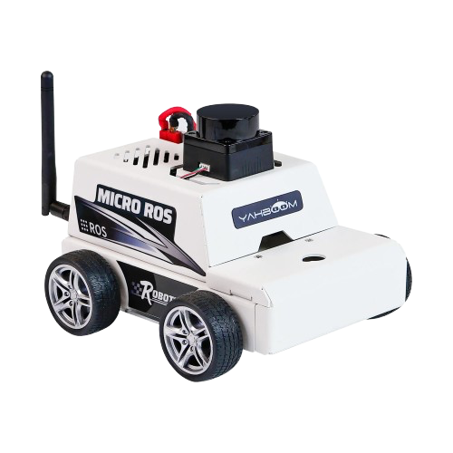

# Yahboom ROS 2
 

ROS 2 workspace for Yahboom ESP32 robot — Micro-ROS, SLAM, and Navigation.

<div align="center">

</div>

## Hardware
- Yahboom ESP32 robot with LiDAR

---

## Setup

### Native — Ubuntu 22.04

**1. Install dependencies**
```bash
sudo apt update && sudo apt install -y \
  ros-humble-robot-localization \
  ros-humble-slam-toolbox \
  ros-humble-navigation2 \
  ros-humble-nav2-bringup \
  ros-humble-rmw-cyclonedds-cpp \
  ros-humble-joint-state-publisher \
  ros-humble-xacro
```

**2. Build**
```bash
git clone --recursive https://github.com/NapatzZ/Yahboom.git
cd Yahboom
rosdep install --from-paths src --ignore-src -r -y
colcon build && source install/setup.bash
```

**3. Bashrc**
```bash
chmod +x src/script/update_bashrc.sh && ./src/script/update_bashrc.sh
source ~/.bashrc
```

---

### Mac — Docker

**1. Build image**
```bash
docker build -t yahboom_ros2_workspace .
```

**2. Run container**
```bash
docker run -it --rm \
  --name yahboom_nav_container \
  -p 8090:8090/udp \
  -p 6080:6080 \
  -e ROS_DOMAIN_ID=20 \
  -v "$(pwd)/src:/ros2_ws/src" \
  yahboom_ros2_workspace bash
```

**3. Build inside container (first run)**
```bash
colcon build && source install/setup.bash
```

> Python node edits apply on the next launch — no rebuild needed.  
> C++ or `.msg`/`.srv` changes require `colcon build`.

---

## Robot Configuration

Connect robot via USB, run once per robot or when WiFi/network changes:

```bash
python3 src/script/robot_config.py
```

Edit `src/script/robot_config.py` → `__main__` if needed:

| Setting | Mac | Linux |
|---------|-----|-------|
| Serial port | `/dev/tty.usbserial-0001` | `/dev/ttyUSB0` |
| WiFi | Keychain auto-detect (may prompt) | `nmcli` auto-detect |

The script writes config, reads it back to verify, then reboots the board automatically.

---

## Running

Use `byobu` for multiple terminals — `F2` new window, `F3`/`F4` switch.

### 1 — Micro-ROS Agent
```bash
ros2 run micro_ros_agent micro_ros_agent udp4 --port 8090
```
Wait for `session established` before continuing.

### 2 — Bringup
```bash
ros2 launch yahboom_bringup native_bringup.launch.py
```

### 3 — SLAM Mapping
```bash
# Terminal A — start SLAM
ros2 launch yahboom_nav2 online_async_launch.py

# Terminal B — drive robot to map the area
ros2 run teleop_twist_keyboard teleop_twist_keyboard
```

### 4 — Save Map
```bash
ros2 run yahboom_nav2 map_saver
```
Saved to `src/yahboom_nav2/maps/map.yaml` and `map.pgm`.

### 5 — Navigation
```bash
ros2 launch yahboom_nav2 navigate.launch.py
```

---

## Visualization

### Native
```bash
rviz2
```

### Mac — noVNC
RViz runs inside the container. Open in any browser — no X11 or XQuartz needed.

```
http://localhost:6080/vnc.html
```

Then inside the container:
```bash
rviz2
```

---

## Navigation Interfaces

Commands available after `navigate.launch.py` is running:

```bash
# Save current position
ros2 service call /yahboom_esp32/nav/save_location yahboom_interfaces/srv/SaveLocation "{location_name: 'point_a'}"

# Move forward N meters
ros2 service call /yahboom_esp32/nav/move_distance yahboom_interfaces/srv/MoveDistance "{distance: 1.0}"

# Rotate N degrees
ros2 service call /yahboom_esp32/nav/rotate_degree yahboom_interfaces/srv/RotateDegree "{degrees: 90.0}"

# Navigate to saved location
ros2 service call /yahboom_esp32/nav/nav_to_location yahboom_interfaces/srv/NavToLocation "{location_name: 'point_a'}"
```

---

## Vision

```bash
# Start camera agent (port 9999)
bash src/script/start_camera_computer.sh

# Start vision stack
ros2 launch yahboom_vision vision.launch.py

# Trigger human detection
ros2 service call /yahboom_esp32/vision/human_detection yahboom_interfaces/srv/HumanDetection "{timeout: 5.0}"
```

> Camera ESP32 → port **9999** · Robot ESP32 → port **8090** (both agents must run simultaneously)

---

## Troubleshooting

| Symptom | Fix |
|---------|-----|
| No USB serial port on Mac | `brew install --cask wch-usb-serial` |
| `session re-established` loop | Use `-p 8090:8090/udp`, not `--net=host`, on Mac |
| noVNC blank / not loading | Wait ~5s after container start for Xvfb to init |
| RViz black screen | `export LIBGL_ALWAYS_SOFTWARE=1` (already set in entrypoint) |
| `Waiting for laser_scans` | LiDAR not connected — check robot and micro-ROS agent |
| Publisher count 0 on `/scan` | DDS mismatch — run everything in a single container |
| No image on camera topic | Camera agent not running — run `start_camera_computer.sh` first |
